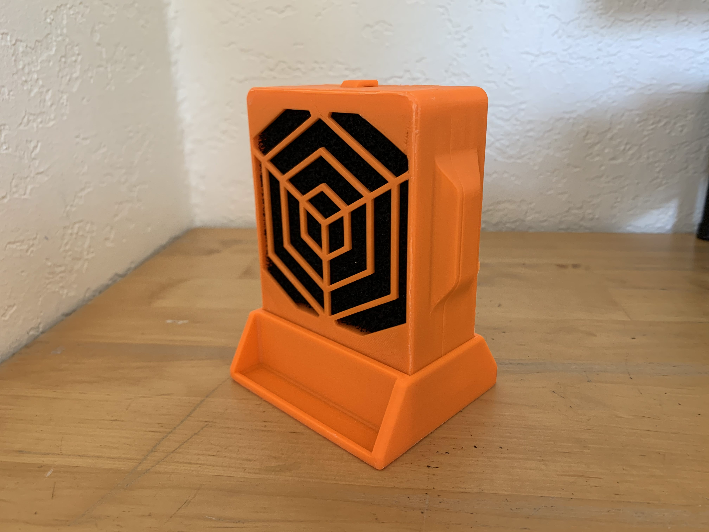
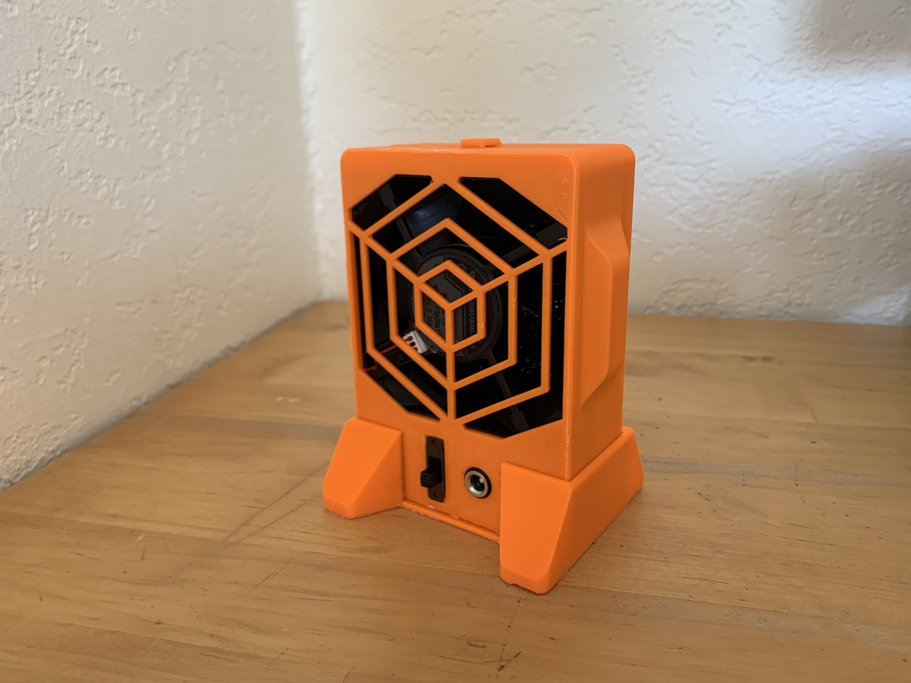
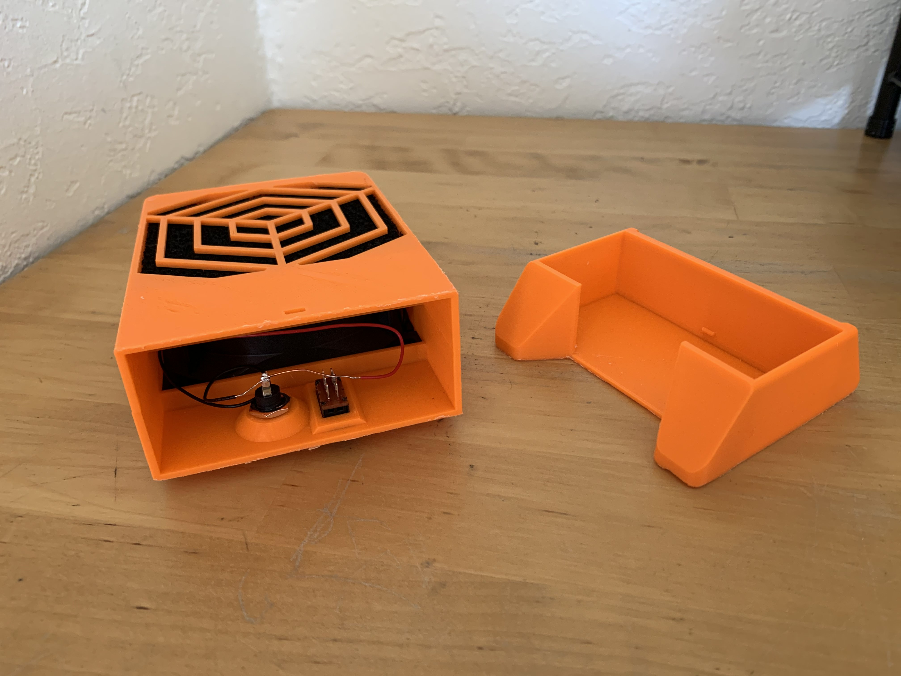
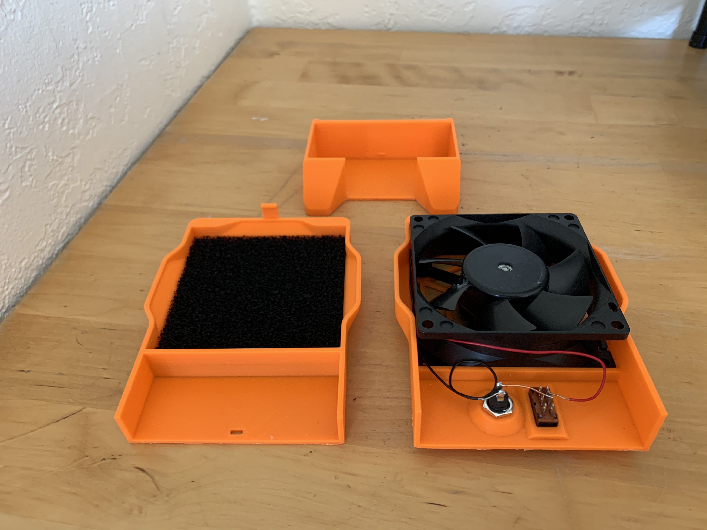

# 3D-Printed Fume Extractor Case

This is an encasing for an 80x80x25.5mm 12v fan and 10mm thick carbon filter. It's a personal-size fume extractor for soldering. The STL files can be found in `fume-extractor-stl.zip` on this repository.

I designed the case in Fusion 360 and printed it on a Dremel 3D45 with a brim and no supports.

This is the front of the fume extractor. The dark void inside the hexa-grill (patent pending) is the carbon filter meant to filter out all the rosin smoke from soldering. No asthma!

This is the back of the extractor, where the air flows out. The fan is a Panaflo FBA08A-12U (the cheapest used computer fan I could find) and uses a 12V supply (from the DC connector) going through a power switch.

The case is printed in 3 parts: front, back, and base. The front and back parts enclose the electroinics and then slide into the base. This allows for easy disassembly and access, should the rudimentary electronics need maintenance.

This was a small CAD/3DP project to add to my personal DIY soldering station.
